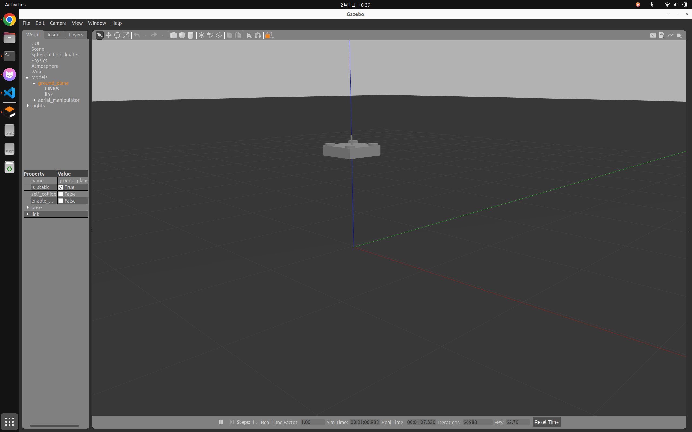
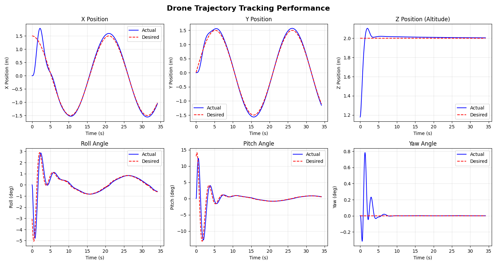
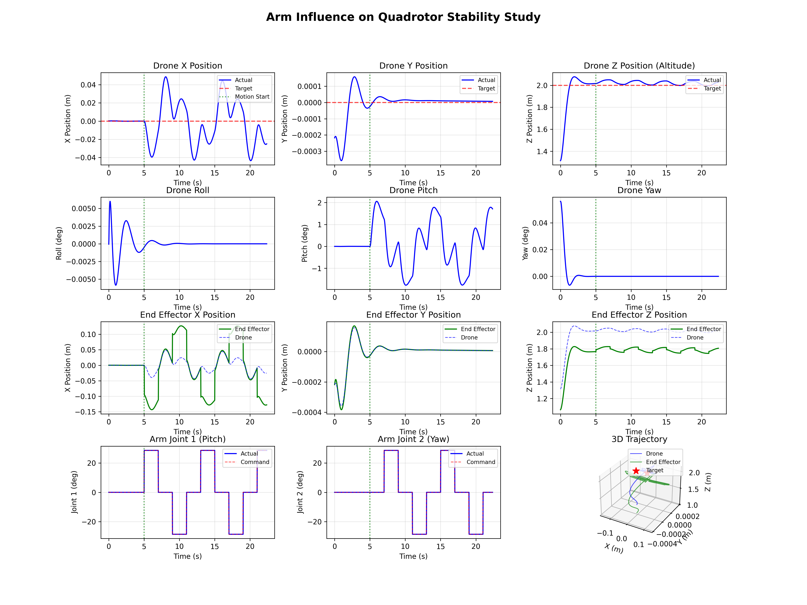
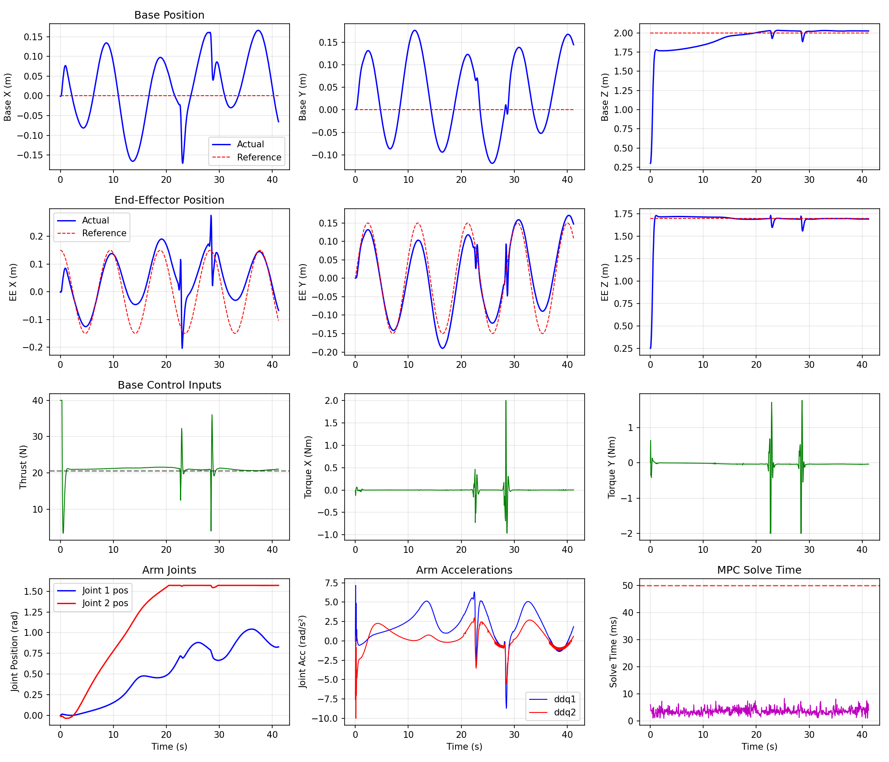

# Aerial Manipulator (am_description)

A ROS 2 package for simulating an aerial manipulator system in Gazebo.


## Table of Contents
- [Logs](#logs)
- [Dependencies](#dependencies)
- [Installation](#installation)
- [Basic Usage](#basic-usage)
  - [Launch the Simulation](#launch-the-simulation)
  - [Using the Drone Controller Script](#using-the-drone-controller-script)
  - [Using the Trajectory Controller](#using-the-trajectory-controller)
  - [Using the Arm Controller](#using-the-arm-controller)
- [MPC Controllers](#mpc-controllers)
  - [Standard MPC (scipy-based)](#standard-mpc-scipy-based)
  - [Acados MPC (full system)](#acados-mpc-full-system)
  - [Acados MPC Base (quadrotor only)](#acados-mpc-base-quadrotor-only)
  - [Acados MPC End-Effector (EE tracking)](#acados-mpc-end-effector-ee-tracking)
- [Other terminal usage](#other-terminal-usage)
  - [Control the Drone (Thrust)](#control-the-drone-thrust)
  - [Control the Arm Joints](#control-the-arm-joints)
  - [View Joint States](#view-joint-states)
  - [Check Controllers](#check-controllers)
- [Package Structure](#package-structure)
- [Controllers](#controllers)
- [URDF Details](#urdf-details)
  - [Links](#links)
  - [Joints](#joints)
  - [Gazebo Plugins](#gazebo-plugins)
- [Physical Parameters](#physical-parameters)


## Logs

TODO

- implement dynamic model

- optimize MPC penalize


## Dependencies

- Ubuntu 22.04
- ROS 2 Humble
- Gazebo Classic 11 (sudo apt install ros-humble-gazebo-ros-pkgs)
- gazebo_ros, gazebo_ros2_control
- ros2_control, ros2_controllers


## Installation

1. Clone this package into your ROS 2 workspace:
```bash
cd ~/am_ws/src
git clone <repository_url>
```

2. Install dependencies:
```bash
cd ~/am_ws
rosdep install --from-paths src --ignore-src -r -y
```

3. Build the package:
```bash
cd ~/am_ws/
colcon build --packages-select am_description
source install/setup.bash
```

## Basic Usage

### Launch the Simulation

```bash
ros2 launch am_description am_launch.launch.py
```

This will:
- Start Gazebo with the aerial manipulator model
- Load the robot URDF with ros2_control
- Spawn the robot at position (0, 0, 1)
- Load and activate joint_state_broadcaster and arm_controller

<p align="center">
  
</p>


### Using the Drone Controller Script

An interactive Python script is provided:

```bash
ros2 run am_description drone_controller.py
```

### Using the Trajectory Controller

An autonomous trajectory following controller:

```bash
ros2 run am_description trajectory_controller.py
```

<p align="center">
  
</p>


Commands:
- `start <mode>` - Start trajectory following (modes: hover, circle, square, figure8)
- `stop` - Stop the controller
- `status` - Show current status
- `quit` - Exit

The trajectory controller uses PID control to make the drone:
- Take off and hover at 2m height
- Follow circular, square, or figure-8 trajectories
- Maintain stable flight with position and attitude control

### Using the Arm Controller

a new script that hovers the drone and then moves the arm while logging both the drone position and end effector position.

```bash
ros2 run am_description arm_influence_study.py
```

Commands:
- `takeoff` - Apply 30% extra thrust to lift off
- `hover` - Apply hover thrust (~20.6N)
- `land` - Reduce thrust for landing
- `stop` - Turn off motors
- `up` / `down` - Adjust thrust ±2N
- `thrust <N>` - Set specific thrust value
- `arm <j1> <j2>` - Set arm joint positions in radians
- `quit` - Exit

<p align="center">
  
</p>

## MPC Controllers

See doc
[README_mpc](am_description/mpc/README_mpc.md)

### Standard MPC (scipy-based)

Full aerial manipulator MPC with 15 states (position, velocity, quaternion, angular velocity, arm joints) and 6 controls. Uses scipy optimization - too slow to run.

```bash
ros2 run am_description mpc_controller.py
```

To test mpc solver performance (scipy is too slow):
```bash
cd ~/am_ws/src/am_description
python -m am_description.mpc.mpc_solver
```


### Acados MPC (full system)

High-performance MPC using acados for real-time optimization. Same 15-state model as above but 10-100x faster.

Acados install [INSTALL_ACADOS](am_description/mpc/INSTALL_ACADOS.md)

MPC details [README](am_description/mpc_acados/README.md)

```bash
ros2 run am_description acados_mpc_controller.py
```

Commands: `start <mode>`, `stop`, `status`, `stats`, `plot`, `quit`  
Modes: `takeoff`, `hover`, `circle`, `square`, `figure8`, `up`

**TODO**

### Acados MPC Base (quadrotor only)

Simplified MPC for quadrotor base control only (no arm). 13 states, 4 controls. Fastest solver.

```bash
ros2 run am_description mpc_base_controller.py
```

Commands: `start <mode>`, `stop`, `plot`, `stats`, `quit`  
Modes: `hover`, `circle`, `square`, `figure8`, `takeoff`, `up`

### Acados MPC End-Effector (EE tracking)

Whole-body MPC that tracks an end-effector (EE) trajectory by controlling both the base (thrust + torques) and the arm joints.

```bash
ros2 run am_description mpc_controller_ef.py
```

Commands: `start <mode>`, `stop`, `status`, `stats`, `plot`, `quit`  
Modes: `hover`, `circle`, `line`, `vertical`, `reach`, `forest`

Notes:
- `cost_mode` parameter selects the MPC cost formulation:
  - `ik`: EE tracking via IK to joint references (linear LS on state/input)
  - `ee`: direct EE position penalty (nonlinear LS)
- In simulation, you may want to disable ground-truth override if your sim does not publish a GT odometry topic: set `use_ground_truth:=false`.

MPC details [README](am_description/mpc_ef/README.md)

<p align="center">
  
</p>

## Other terminal usage

### Control the Drone (Thrust)

The drone uses `gazebo_ros_force` plugin to apply thrust. Publish to `/aerial_manipulator/thrust`:

```bash
# Takeoff (apply ~25N upward force, hover is ~20.6N for 2.1kg mass)
ros2 topic pub /aerial_manipulator/thrust geometry_msgs/msg/Wrench "{force: {z: 25.0}}" -r 50

# Stop
ros2 topic pub /aerial_manipulator/thrust geometry_msgs/msg/Wrench "{force: {z: 0.0}}" --once
```

### Control the Arm Joints

The arm uses `ForwardCommandController` for position control. Send commands to both joints:

```bash
# Move arm to position [joint1, joint2] in radians (range: -1.57 to 1.57)
ros2 topic pub /arm_controller/commands std_msgs/msg/Float64MultiArray "{data: [0.5, 0.3]}" --once
```

### View Joint States

```bash
ros2 topic list
ros2 topic echo /joint_states
```

### Check Controllers

```bash
ros2 control list_controllers
ros2 control list_hardware_interfaces
```

## Package Structure

```
am_description/
├── config/
│   └── controllers.yaml          # Controller configurations
├── launch/
│   └── am_launch.launch.py       # Main launch file
├── scripts/
│   └── drone_controller.py       # Interactive drone controller
├── urdf/
│   └── am_min.urdf               # Robot description with ros2_control
├── meshes/                        # (Optional) 3D mesh files
├── CMakeLists.txt
├── package.xml
└── README.md
```

## Controllers

The package uses two controllers:

1. **joint_state_broadcaster**: Publishes joint states to `/joint_states` topic
2. **arm_controller**: ForwardCommandController for both arm joints (position interface)

Joint limits: ±1.57 radians (±90°)

## URDF Details

### Links
- **base_link**: Quadrotor body, 0.4×0.4×0.1m box (gray), mass 1.5kg
- **rotor_1/2/3/4**: Four rotors at corners (visual only)
- **arm_base_link**: Arm mount, 0.05m cylinder (blue)
- **arm_link_1**: First arm segment, 0.1m cylinder (green)
- **arm_link_2**: Second arm segment, 0.1m cylinder (red)

### Joints
- **rotor_X_joint**: Fixed joints for rotor visuals
- **arm_mount**: Fixed joint connecting arm to quadrotor
- **arm_joint_1**: Revolute joint (Y-axis rotation, ±90°)
- **arm_joint_2**: Revolute joint (Z-axis rotation, ±90°)

### Gazebo Plugins
- **gazebo_ros_force**: Applies thrust force to base_link via `/aerial_manipulator/thrust` topic
- **gazebo_ros2_control**: Provides ros2_control hardware interface for arm joints

## Physical Parameters

| Component | Mass (kg) |
|-----------|-----------|
| base_link | 1.5 |
| arm_base_link | 0.2 |
| arm_link_1 | 0.1 |
| arm_link_2 | 0.1 |
| rotor (×4) | 0.05 each |
| **Total** | **2.1** |

Hover thrust required: 2.1 × 9.81 ≈ **20.6 N**

